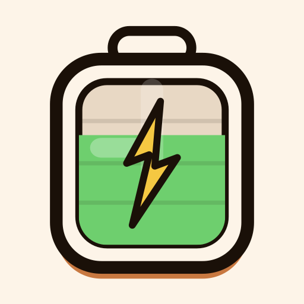
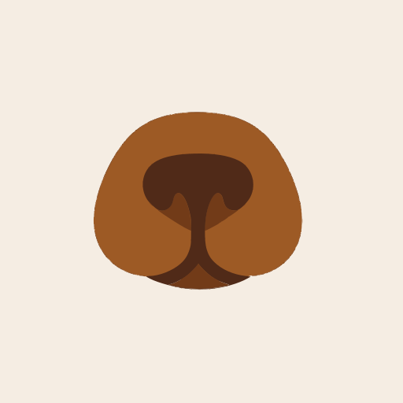

# Daniel Carvajal · dacape.dev

Desarrollador y creador de contenido. Más de una década construyendo productos propios con obsesión por el detalle, la privacidad y la experiencia de usuario.

---

## Apps

| | App | Descripción |
|---|---|---|
|  | **[Breakflow](https://dacape.dev/dacape_dev/breakflow/)** | Pomodoro con IA que recomienda el ciclo ideal para cada tarea |
|  | **[CatchIR](https://dacape.dev/dacape_dev/catchir/)** | Juego de caza de objetos reales con IA a través de la cámara |
|  | **[Snoutly](https://dacape.dev/dacape_dev/snoutly/)** | Identifica razas de perro al instante con IA offline |

---

## Stack habitual

---

## Encuéntrame

